User Manual
====================
This is the user manual of BoxMover game written by htc550605125.

Overview
====================
The BoxMover game is one of the classic games. The player needs to move all the boxes to the destination. For example:  
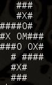 -> 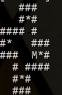

Howto Play
====================
Run

    ./start.sh

under linux, or
    
    start.bat
    
under windows.

First choose a map to load or delete a save slot :  
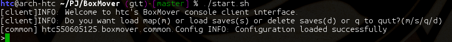

Type "m" to load local map, then choose map 1:  
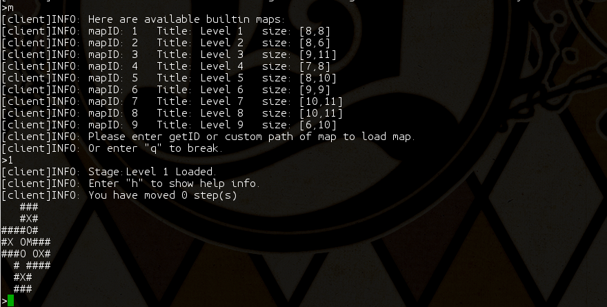

Let's start the game!
Type "h" to show help information :  
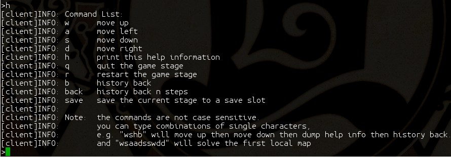

Let's skip the first stage quickly, just type "wsaadsswdd" :  
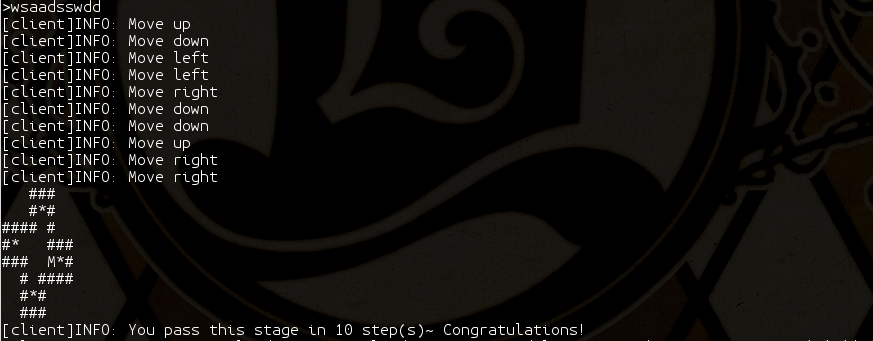

Congratulations!

Howto move back
==================
You can type "b" or "back" to roll back history moves:  
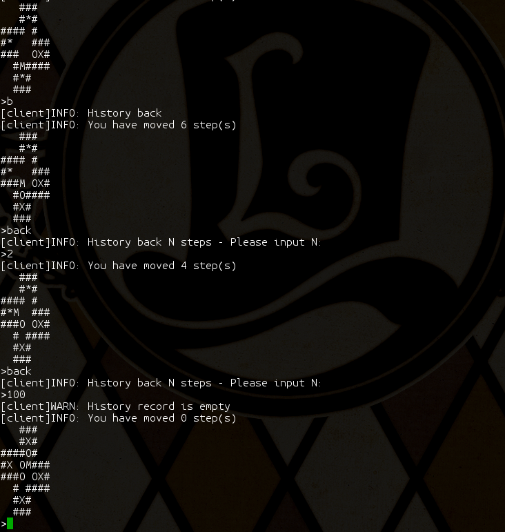

Howto Save
==================
Type "save" at the middle of one stage :  
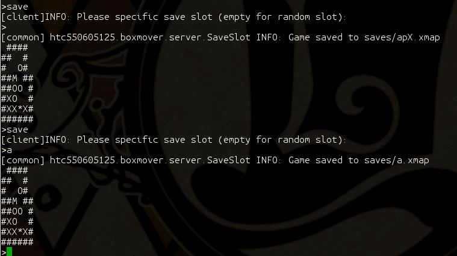

And then, quit the stage, type "s" to load one save :  
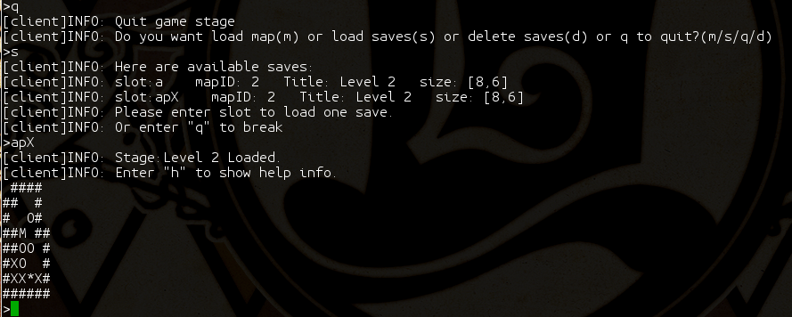

Let's continue the game now~

Or you can type "d" to delete one save :  
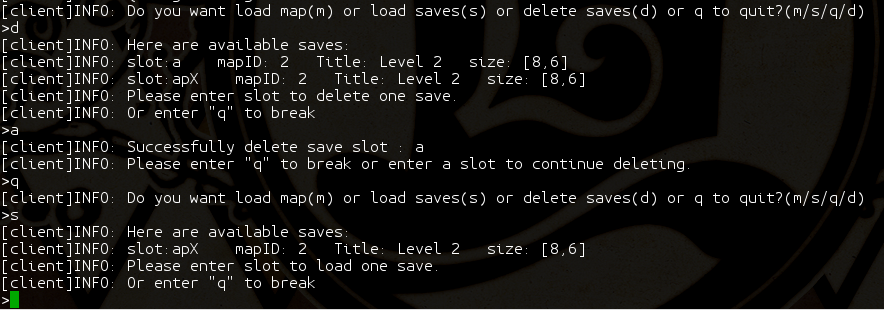

If you are dead or you cannot move
=================
If you are not allowed to move, or sometimes if you are not possible to win, the game will remind you that :  
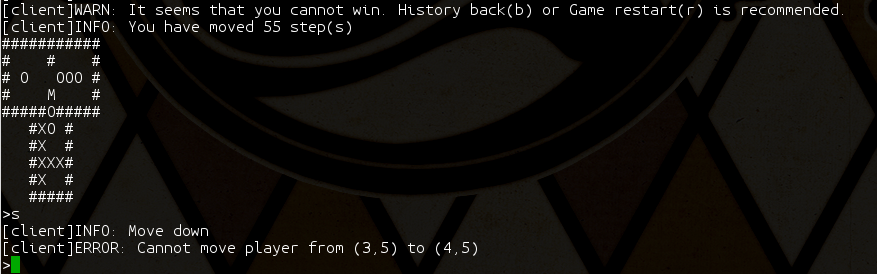

Customize!
=================
You can modify the __config.json__  to change some settings of the game, for example:

* More local files by adding fields to __server/file maps/maps/__
* Change the definition of different number occurs in the input maps by modifing __server/filemaps/config/__
* Change the console map performance by modifing __client/console/config/__

